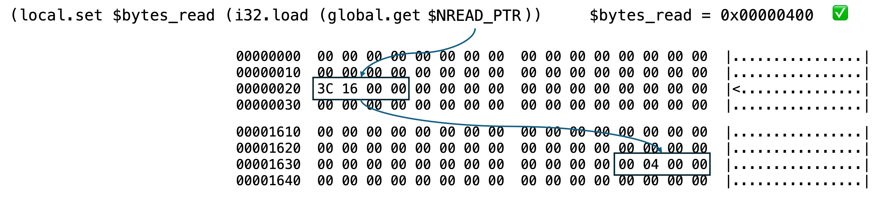

# Step 3: Plan the Layout of Linear Memory

Planning how you want linear memory laid out is both very important, and not something you're going to get right the first time, or the second, or the third (I mean it...)

## The WebAssembly Sandbox

We have already mentioned that a WebAssembly module runs inside a sandboxed environment that isolates it from the outside world.
However, inside that sandboxed environment, linear memory is completely open.

You have total freedom to write any data to any location!

In other words, if you're not careful, you can make a big mess very quickly!

😱

## Memory Layout Tips and Tricks

In reality, memory layout is something that evolves during development.
That said, there are some tips and tricks I've learned that can make life a lot easier:

1. Don't worry about a few empty bytes here and there &mdash; or to say that the other way around, don't pack values tightly up against each other.
   Leave some space between them, because as you develop the program, you are going to see better ways to arrange memory.
2. Never hardcode pointer addresses in the coding; instead store them as global values.
   This is because when (not if) you decide to rearrange the memory layout, you only need to update the named pointer once.
3. Align values to word boundaries
4. Allocate a reasonable amount of space for values whose length you cannot know until runtime (E.G. the command line arguments)
5. Define one region of memory for pointers and lengths and a separate reqion for string values (E.G. error or debug/trace messages) with a reasonable gap between them.
   How you choose to divide up memory is entirely arbitrary, but you need to formulate a plan, then stick to it.
6. There is no bounds checking when reading from or writing to linear memory

   You are entirely responsible for checking how much data you write to a particular offset.
   In other words, if you're not very precise about offset and length calculations, you could easily trample over your own data.
   (I speak from experience 😃).
7. During development, it is very useful to create one or more trace/debug functions.

   In the source code, you will see functions such as `$hexdump`, or `$write_msg`, or `$write_msg_with_value` etc.
   These functions exist simply to trace the flow of data at runtime, and they do not need to be removed once you get the program working.

   The calls to these debug/trace functions can simply be commented out.
   After you compile the working version of the WASM module, if you optimise the `.wasm` file by passing it through `wasm-opt`, all uncalled functions will be removed from the binary.

## Building a Memory Map

Write out a memory map in which you plan where all your important values are going to live.

In the SHA256 program, the first 1.5Kb or so of memory in page 1 has been arranged like this:

```wat
  ;; - - - - - - - - - - - - - - - - - - - - - - - - - - - - - - - - - - - - - - - - - - - - - - - - - - - - - - - - - -
  ;; Memory Map
  ;;             Offset  Length   Type    Description
  ;; Page 1: 0x00000000       4   i32     file_fd
  ;;         0x00000008       8   i64     fd_seek file size + 9
  ;;         0x00000010       8   i32x2   Pointer to read iovec buffer address + size
  ;;         0x00000018       8   i32x2   Pointer to write iovec buffer address + size
  ;;         0x00000020       8   i64     Bytes transferred by the last io operation
  ;;         0x00000030       8   i64     File size (Little endian)
  ;;         0x00000040       8   i64     File size (Big endian)
  ;;         0x00000050       4   i32     Pointer to file path name
  ;;         0x00000054       4   i32     Pointer to file path length
  ;; Unused
  ;; - - - - - - - - - - - - - - - - - - - - - - - - - - - - - - - - - - - - - - - - - - - - - - - - - - - - - - - - - -
  ;;         0x00000100      32   i32x8   Constants - fractional part of square root of first 8 primes
  ;;         0x00000120     256   i32x64  Constants - fractional part of cube root of first 64 primes
  ;;         0x00000220      64   i32x8   Hash values
  ;;         0x00000260     512   data    Message digest
  ;;         0x00000470      64   data    ASCII representation of SHA value
  ;;         0x000004B0       2   data    Two ASCII spaces
  ;;         0x000004B8       5   data    Error message prefix "Err: "
  ;;         0x000004C0       4   i32     Number of command line arguments
  ;;         0x000004C4       4   i32     Command line buffer size
  ;;         0x000004C8       4   i32     Pointer to array of pointers to arguments (needs double dereferencing!)
  ;;         0x00000500     256   data    Command line args buffer
```

Based on this map, the following global declarations are then made:

```wat
  (global $FD_FILE_PTR         i32 (i32.const 0x00000000))
  (global $FILE_SIZE_PTR       i32 (i32.const 0x00000008))
  (global $IOVEC_READ_BUF_PTR  i32 (i32.const 0x00000010))
  (global $IOVEC_WRITE_BUF_PTR i32 (i32.const 0x00000018))
  (global $NREAD_PTR           i32 (i32.const 0x00000020))
  (global $FILE_SIZE_LE_PTR    i32 (i32.const 0x00000030))
  (global $FILE_SIZE_BE_PTR    i32 (i32.const 0x00000040))
  (global $FILE_PATH_PTR       i32 (i32.const 0x00000050))
  (global $FILE_PATH_LEN_PTR   i32 (i32.const 0x00000054))

  (global $INIT_HASH_VALS_PTR  i32 (i32.const 0x00000100))
  (global $CONSTANTS_PTR       i32 (i32.const 0x00000120))
  (global $HASH_VALS_PTR       i32 (i32.const 0x00000220))
  (global $MSG_DIGEST_PTR      i32 (i32.const 0x00000260))
  (global $ASCII_HASH_PTR      i32 (i32.const 0x00000470))
  (global $ASCII_SPACES        i32 (i32.const 0x000004B0))
  (global $ERR_MSG_PREFIX      i32 (i32.const 0x000004B8))
  (global $ARGS_COUNT_PTR      i32 (i32.const 0x000004C0))
  (global $ARGV_BUF_LEN_PTR    i32 (i32.const 0x000004C4))
  (global $ARGV_PTRS_PTR       i32 (i32.const 0x000004C8))
  (global $ARGV_BUF_PTR        i32 (i32.const 0x00000500))
```

Almost all of these values store pointer references.

## Global Pointer References

One thing you need to get clear in your mind is distinguishing when you're working with a value and when you're working with a pointer to a value.

The following diagram shows an example of an easy mistake to make when working with a pointer reference.

When reading a file, we need to call the WASI function `$wasi.fd_read`.
After this call has completed, the memory location identified by the global reference `$NREAD_PTR` is updated with a pointer that points to an `i32` holding the number of bytes that have just been read.


If you simply read the value of `$NREAD_PTR`, you will get the address of the value (`0x163C`), not the value itself.

```wat
(local.set $bytes_read (global.get $NREAD_PTR))             ;; $bytes_read = 0x0000163C  ❌
```

Instead, you must read the `i32` value at the location pointed to by `$NREAD_PTR`.
Only now will you get the correct value.

```wat
(local.set $bytes_read (i32.load (global.get $NREAD_PTR)))  ;; $bytes_read = 0x00000400  ✅
```



## Static Data

In the case of the SHA256 hash calculation, the most important values we will be working with are the seed values upon which the calculation is based and the constants used during message digest calculation.

These values are stored at the locations identified by the global values `$INIT_HASH_VALS_PTR` and `$CONSTANTS_PTR`.
This means that the addresses used in the `data` declarations below must match the addresses stored in these globals.

```wat
  ;; - - - - - - - - - - - - - - - - - - - - - - - - - - - - - - - - - - - - - - - - - - - - - - - - - - - - - - - - - -
  ;; The first 32 bits of the fractional part of the square roots of the first 8 primes 2..19
  ;; Used to initialise the hash values
  ;; The byte order of the raw values defined below is little-endian!
  (data (i32.const 0x00000100)                                   ;; $INIT_HASH_VALS_PTR
    "\67\E6\09\6A" "\85\AE\67\BB" "\72\F3\6E\3C" "\3A\F5\4F\A5"  ;; 0x00000100
    "\7F\52\0E\51" "\8C\68\05\9B" "\AB\D9\83\1F" "\19\CD\E0\5B"  ;; 0x00000110
  )

  ;; The first 32 bits of the fractional part of the cube roots of the first 64 primes 2..311
  ;; Used in phase 2 (hash value calculation)
  ;; The byte order of the raw values defined below is little-endian!
  (data (i32.const 0x00000120)                                   ;; $CONSTANTS_PTR
    "\98\2F\8A\42" "\91\44\37\71" "\CF\FB\C0\B5" "\A5\DB\B5\E9"  ;; 0x00000120
    "\5B\C2\56\39" "\F1\11\F1\59" "\A4\82\3F\92" "\D5\5E\1C\AB"  ;; 0x00000130
    "\98\AA\07\D8" "\01\5B\83\12" "\BE\85\31\24" "\C3\7D\0C\55"  ;; 0x00000140
    "\74\5D\BE\72" "\FE\B1\DE\80" "\A7\06\DC\9B" "\74\F1\9B\C1"  ;; 0x00000150
    "\C1\69\9B\E4" "\86\47\BE\EF" "\C6\9D\C1\0F" "\CC\A1\0C\24"  ;; 0x00000160
    "\6F\2C\E9\2D" "\AA\84\74\4A" "\DC\A9\B0\5C" "\DA\88\F9\76"  ;; 0x00000170
    "\52\51\3E\98" "\6D\C6\31\A8" "\C8\27\03\B0" "\C7\7F\59\BF"  ;; 0x00000180
    "\F3\0B\E0\C6" "\47\91\A7\D5" "\51\63\CA\06" "\67\29\29\14"  ;; 0x00000190
    "\85\0A\B7\27" "\38\21\1B\2E" "\FC\6D\2C\4D" "\13\0D\38\53"  ;; 0x000001A0
    "\54\73\0A\65" "\BB\0A\6A\76" "\2E\C9\C2\81" "\85\2C\72\92"  ;; 0x000001B0
    "\A1\E8\BF\A2" "\4B\66\1A\A8" "\70\8B\4B\C2" "\A3\51\6C\C7"  ;; 0x000001C0
    "\19\E8\92\D1" "\24\06\99\D6" "\85\35\0E\F4" "\70\A0\6A\10"  ;; 0x000001D0
    "\16\C1\A4\19" "\08\6C\37\1E" "\4C\77\48\27" "\B5\BC\B0\34"  ;; 0x000001E0
    "\B3\0C\1C\39" "\4A\AA\D8\4E" "\4F\CA\9C\5B" "\F3\6F\2E\68"  ;; 0x000001F0
    "\EE\82\8F\74" "\6F\63\A5\78" "\14\78\C8\84" "\08\02\C7\8C"  ;; 0x00000200
    "\FA\FF\BE\90" "\EB\6C\50\A4" "\F7\A3\F9\BE" "\F2\78\71\C6"  ;; 0x00000210
  )
```
