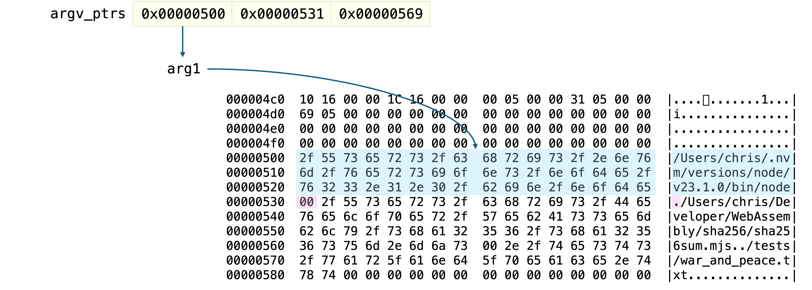
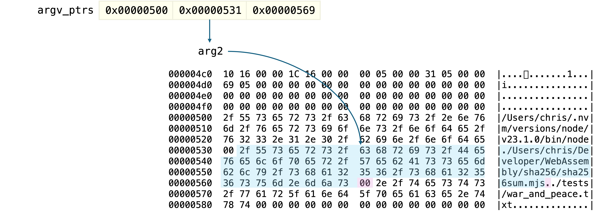
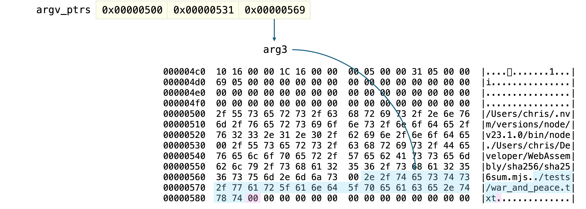

# Step 4: Extract the Filename from the Comand Line Arguments

All we know at this point is that we have been passed `3` arguments and the total length of the command line string is `131` characters.

This doesn't immediately answer the question of *"What is the value of the 3rd argument"*, but this information is vital if we're going to be able to interpret the information returned by the next WASI function, `args_get`.

Again, looking at the [WASI Rust implementation](https://github.com/bytecodealliance/wasmtime/blob/06377eb08a649619cc8ac9a934cb3f119017f3ef/crates/wasi-preview1-component-adapter/src/lib.rs#L471) will help us understand how to call this function.

```rust
pub unsafe extern "C" fn args_get(argv: *mut *mut u8, argv_buf: *mut u8) -> Errno
```

When we call `args_get`, we must pass two more pointers.
`args_get` then updates the memory at the addresses pointed to by these pointers.

```wat
(call $wasi_args_get (global.get $ARGV_PTRS_PTR) (global.get $ARGV_BUF_PTR))
drop
```

The first argument (`argsv_ptrs_ptr`) is a pointer to a list of pointers.
This list contains the same number of entries as is found in the `argc` variable. which in our case, is three.
So we know that the next three `i32` values starting at `argv_ptrs_ptr` will point us to the 1st, 2nd and 3rd arguments in the command line string.

The second argument (`argv_buf`) is a pointer to the actual command line string.


Each argument in the command string is terminated with a null (`0x00`) character.
Don't forget that the total command string length also counts these null characters!

## Extracting the Filename

Having already established that we have been passed at least 3 arguments, calculating the length of the third argument depends upon whether we have received exactly 3 arguments, or more than 3.

If we were to write this calculation in JavaScript, it would look something like this:

```javascript
let arg3_len = (argc == 3 ? arg1_ptr + argv_buf_len : arg4_ptr) - arg3_ptr - 1
```

That same logic look like this when implemented in WebAssembly Text

```wat
;; Calculate the length of the filename in arg3 (counting from 1)
;; arg3_len = (argc == 3 ? arg1_ptr + argv_buf_len : arg4_ptr) - arg3_ptr - 1
(i32.store
  (global.get $FILE_PATH_LEN_PTR)
  (i32.sub
    (i32.sub
      (if  ;; Check argument count
        (result i32)
        (i32.eq (local.get $argc) (i32.const 3))
        (then
          ;; $argc == 3 -> arg1_ptr + argv_buf_len
          (i32.add (i32.load (global.get $ARGV_PTRS_PTR)) (local.get $argv_buf_size))
        )
        (else
          ;; $argc > 3 -> arg4_ptr
          (i32.load (i32.add (global.get $ARGV_PTRS_PTR) (i32.const 12)))
        )
      )
      (i32.load (i32.add (global.get $ARGV_PTRS_PTR) (i32.const 8)))  ;; arg3_ptr
    )
    (i32.const 1)  ;; Must account for the null terminator!
  )
)
```

Using the values from this situation we have:

```javascript
arg3_len = arg1_ptr + argv_buf_len - arg3_ptr - 1
arg3_len = 0x0500 + 0x0083 - 0x0569 - 1
arg3_len = 0x1a - 1
arg3_len = 0x19
```

So the length of argument 3 is `0x19` or 25 in decimal.






	
